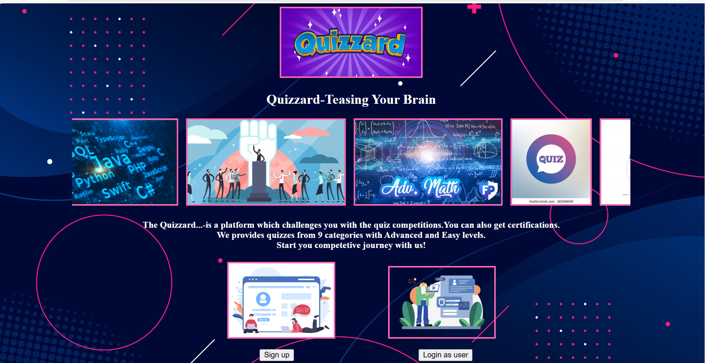
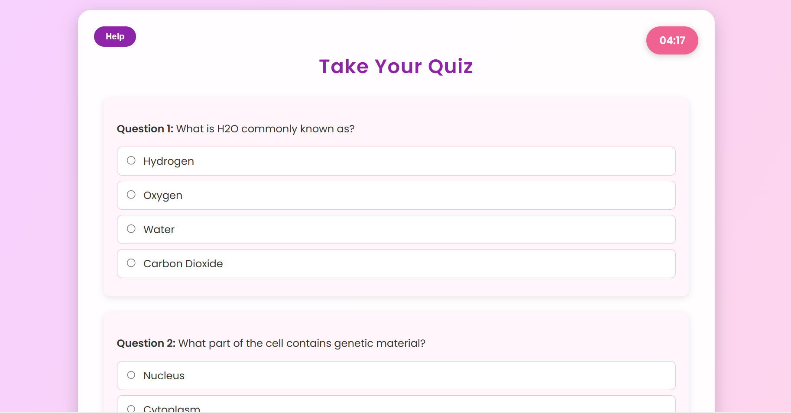
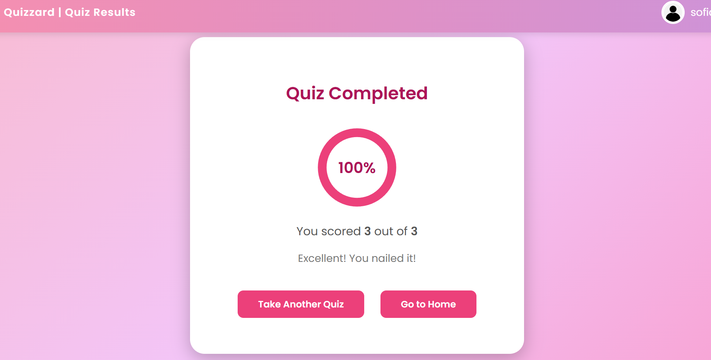

# 🎯 Quizaard – Online Learning & Quiz Platform

Quizaard is a Java Full Stack Web Application developed to provide an interactive online quiz experience.  
The platform allows users to register, login, attempt quizzes from various categories, and receive dynamic results instantly.

---

## 🚀 Project Description

Quizaard is designed as an online learning platform where users can improve their knowledge by attempting quizzes from different categories.

The system securely stores user credentials, quiz questions, and user responses in a MySQL database.  
Results are calculated dynamically using backend logic built with Servlets and JDBC.

---

## 🛠️ Tech Stack

### 💻 Backend
- Java
- JDBC
- Servlets
- JSP

### 🗄️ Database
- MySQL

### 🎨 Frontend
- HTML
- CSS
- JavaScript

---

## 🔐 Features

- ✅ User Registration & Login Authentication
- ✅ Secure Session Management
- ✅ Multiple Quiz Categories
- ✅ Dynamic Question Loading from Database
- ✅ User Answer Storage in Database
- ✅ Automatic Score Calculation
- ✅ Real-Time Result Generation
- ✅ Clean and Responsive User Interface

---

## 🧠 System Workflow

1. User registers and logs in.
2. Credentials are validated using JDBC.
3. User selects a quiz category.
4. Questions are fetched dynamically from MySQL.
5. User answers are stored in database.
6. Score is calculated instantly.
7. Final result is displayed to the user.

---

## 📸 Project Screenshots

---

## ⚙️ How to Run the Project

1. Clone the repository
   git clone https://github.com/Sandhya23761A1232/Quizaard.git

2. Import into NetBeans / Eclipse

3. Configure MySQL Database

4. Update database username & password in JDBC connection file

5. Run on Apache Tomcat Server

---

---

## 👩‍💻 Developed By

**Swathi Mekala**  
B.Tech Information Technology  
Java Full Stack Developer

---

⭐ If you like this project, please give it a star!
